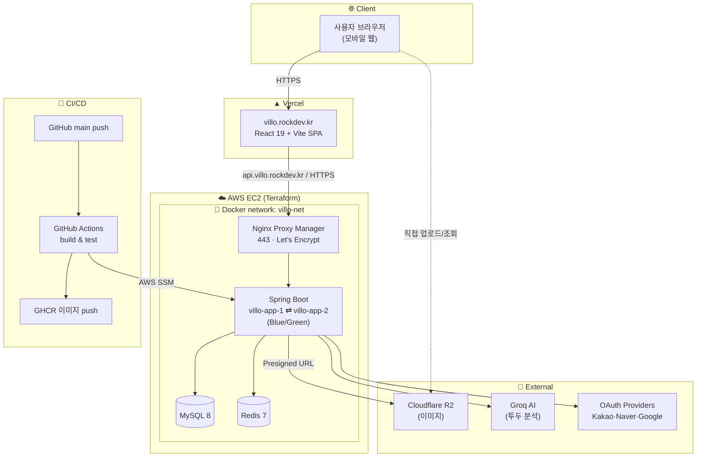
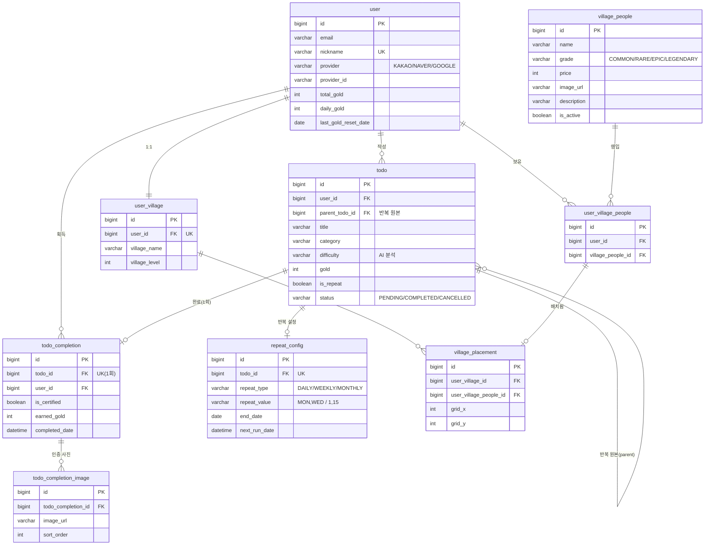

<div align="center">

# 🏡 Villo

**할 일을 퀘스트로 등록하고, 완료할수록 나만의 마을이 성장하는 투두 게이미피케이션 앱**

[](https://villo.rockdev.kr)

</div>

---

## 📑 목차

1. [프로젝트 개요](#1-프로젝트-개요)
2. [기술 스택](#2-기술-스택)
3. [핵심 기능](#3-핵심-기능)
4. [시스템 아키텍처](#4-시스템-아키텍처)
5. [ERD](#5-erd)
6. [API 명세서](#6-api-명세서)
7. [프로젝트 구조](#7-프로젝트-구조)
8. [실행 방법](#8-실행-방법)
9. [트러블슈팅](#9-트러블슈팅)
10. [회고](#10-회고)

---

## 1. 프로젝트 개요

> **매일의 할 일을 게임의 퀘스트처럼.** 지루한 투두 관리에 '동물의 숲' 감성의 마을 성장 요소를 결합했습니다.

할 일(투두)을 등록하면 AI가 카테고리·난이도·보상 골드를 자동으로 분석해 하나의 **퀘스트**로 만들어 줍니다. 사용자는 퀘스트를 완료하며 **골드**를 모으고, 그 골드로 **주민을 영입**해 자신의 **마을을 꾸미고 성장**시킵니다. 꾸준한 성취가 눈에 보이는 마을로 쌓이면서, 할 일 관리에 지속적인 동기를 부여하는 것을 목표로 했습니다.

- **개발 인원 / 역할**: 백엔드 · 인프라 · 프론트엔드 (개인 프로젝트)
- **개발 기간**: 2026.06 ~ 2026.07
- **배포 환경**: 프론트 Vercel · 백엔드 AWS EC2 (무중단 CI/CD)

---

## 2. 기술 스택

### Backend


### Frontend


### Infra / DevOps


| 구분 | 기술 | 선택 이유 |
|---|---|---|
| Language / Framework | Java 21, Spring Boot 3.5 | 안정적인 생태계와 JPA·Security 통합 |
| DB | MySQL 8, Spring Data JPA | 관계형 데이터 모델, 유니크 제약으로 정합성 보장 |
| Cache / Token | Redis 7 | Refresh Token 저장 (TTL 기반 만료) |
| 인증 | OAuth2(Kakao·Naver·Google) + JWT | 소셜 로그인, HttpOnly 쿠키 기반 무상태 인증 |
| AI | Groq | 투두 제목 → 카테고리·난이도·골드 자동 분석 |
| 이미지 | Cloudflare R2 (S3 호환) | Presigned URL 직접 업로드로 서버 부하 최소화 |
| 배포 | EC2 + Nginx Proxy Manager + Docker | HTTPS 종단 + 컨테이너 격리 |
| CI/CD | GitHub Actions + GHCR + AWS SSM | Blue/Green 무중단 배포 |
| IaC | Terraform | VPC·EC2·IAM 인프라 코드화 |

---

## 3. 핵심 기능

### 🔐 인증 / 온보딩
- 카카오 · 네이버 · 구글 **소셜 로그인** (OAuth2)
- JWT **HttpOnly 쿠키** 인증 + Access Token 만료 시 **자동 재발급**(Redis Refresh Token)
- 최초 로그인 시 닉네임 · 마을 이름 **온보딩**

### ✅ 투두(퀘스트)
- 제목만 입력하면 **AI가 카테고리·난이도·보상 골드 자동 분석**
- **반복 퀘스트** (매일 / 매주 요일 / 매월 날짜) — 스케줄러가 자동 생성
- **일반 완료** 와 **사진 인증 완료**(골드 **+30% 보너스**)
- **일일 골드 획득 한도**로 무한 파밍 방지

### 🪙 골드 & 🏘️ 마을 게이미피케이션
- 완료 보상 골드로 **주민 상점**에서 등급별(일반/희귀/에픽/전설) 주민 **영입**
- 마을 그리드에 주민 **배치 · 이동 · 해제**
- **보유 주민 수 기준 마을 레벨업** (레벨에 따라 마을 확장)

### 📊 마이페이지
- 프로필 · 통계(완료 퀘스트 수, **연속 달성일**, 보유 주민 수)
- **완료 기록 달력** + 날짜별 인증 사진 갤러리

---

## 4. 시스템 아키텍처



**배포 파이프라인**: `main`에 백엔드 변경 push → GitHub Actions가 이미지 빌드 → GHCR push → AWS SSM으로 EC2에 원격 명령 → 신규 컨테이너 기동 & `/actuator/health` 확인 → **NPM 업스트림 전환(무중단)** → 구 컨테이너 제거.

---

## 5. ERD



> 주요 유니크 제약: `user(nickname)`, `user(provider, provider_id)`, `todo_completion(todo_id)`, `village_placement(user_village_id, grid_x, grid_y)`, `village_placement(user_village_id, user_village_people_id)`

---

## 6. API 명세서

Swagger(springdoc-openapi)로 문서화되어 있습니다.

> 📖 **Swagger UI**: [https://api.villo.rockdev.kr/swagger-ui/index.html](https://api.villo.rockdev.kr/swagger-ui/index.html)

| 도메인 | Base Path | 주요 엔드포인트 |
|---|---|---|
| Auth | `/api/v1/auth` | 닉네임 설정/중복확인, 토큰 재발급, 로그아웃 |
| Todo | `/api/v1/todos` | 목록·등록·수정·삭제, AI 분석, 완료/사진 인증, Presigned URL |
| Repeat | `/api/v1/todos/{id}/repeat` | 반복 설정 등록·수정·삭제 |
| Village | `/api/v1/village` | 마을 조회, 주민 상점/영입, 배치 CRUD |
| MyPage | `/api/v1/my` | 프로필·통계, 닉네임 변경, 완료 달력·일별 목록 |

---

## 7. 프로젝트 구조

```
Villo/
├── villo_backend/                 # Spring Boot (도메인형 패키지 구조)
│   └── src/main/java/com/villo/
│       ├── domain/
│       │   ├── auth/              # 소셜 로그인 · JWT · 온보딩
│       │   ├── todo/              # 투두 · 반복 · 완료 · 사진 인증 · 스케줄러
│       │   ├── village/           # 마을 · 주민 · 배치
│       │   └── mypage/            # 프로필 · 통계 · 달력
│       └── global/                # config, jwt, s3, exception, response
│   ├── Dockerfile
│   └── docker-compose.infra.yml   # MySQL · Redis (영속 스택)
│
├── villo_frontend/                # React 19 + Vite
│   └── src/
│       ├── api/                   # axios 인스턴스 · 도메인별 API
│       ├── components/            # 공용 · todo · village 컴포넌트
│       ├── pages/                 # auth · todo · village · mypage 화면
│       └── data/                  # 정적 데이터(주민 대사 등)
│
├── infra/                         # Terraform (VPC · EC2 · IAM · SG)
├── docs/                          # 설계 · 작업 로그 · 트러블슈팅
└── .github/workflows/             # backend-deploy.yml (Blue/Green CI/CD)
```

---

## 8. 실행 방법

### 사전 준비 — 환경 변수(`villo_backend/.env`)
```env
# DB
DB_USERNAME=villo
DB_PASSWORD=****
# JWT
JWT_SECRET=****
# OAuth
KAKAO_CLIENT_ID=****     KAKAO_CLIENT_SECRET=****
NAVER_CLIENT_ID=****     NAVER_CLIENT_SECRET=****
GOOGLE_CLIENT_ID=****    GOOGLE_CLIENT_SECRET=****
# AI
GROQ_API_KEY=****
# Cloudflare R2
R2_BUCKET=****   R2_ACCESS_KEY=****   R2_SECRET_KEY=****
R2_ENDPOINT=****  R2_PUBLIC_URL=****
# 배포용
FRONTEND_BASE_URL=****   COOKIE_DOMAIN=****
```

### Backend (로컬)
```bash
cd villo_backend
# MySQL · Redis 컨테이너
docker compose -f docker-compose.infra.yml up -d
# 애플리케이션
./gradlew bootRun
```

### Frontend (로컬)
```bash
cd villo_frontend
npm install
npm run dev        # http://localhost:5173
```

### 배포
- **백엔드**: `main`에 push → GitHub Actions가 자동으로 Blue/Green 무중단 배포
- **프론트**: `main` push → Vercel 자동 배포

---

## 9. 트러블슈팅

> 각 항목은 접혀 있습니다. 제목을 클릭하면 펼쳐집니다.

<details>
<summary><b>🔑 1. 로그인 후 닉네임 설정 시 500 에러 — JWT 필터 스킵 경로 충돌</b></summary>

<br/>

**1️⃣ 문제 상황**

- 로그인된 상태에서 닉네임 최초 설정(`POST /api/v1/auth/nickname`) 호출 시 500 에러가 발생했다.

**2️⃣ 문제 정의**

- `JwtFilter`의 인증 스킵 경로(`PERMIT_URLS`)에 `/api/v1/auth/`가 포함되어 있어, 유효한 Access Token이 쿠키에 있음에도 필터가 JWT 검증 자체를 건너뛰었다.
- 그 결과 `SecurityContext`에 인증 정보가 등록되지 않아 `@AuthenticationPrincipal Long userId`가 `null`로 주입되었고, 이 `null`이 그대로 `userRepository.findById(userId)`에 전달되며 `IllegalArgumentException`이 발생했다.

**3️⃣ 방법 탐색 및 비교**

| 방법 | 장점 | 단점 | 선택 |
|---|---|---|---|
| PERMIT_URLS에서 `/api/v1/auth/` 제거 | 필터가 정상적으로 토큰을 검증해 userId 주입, 근본 원인 해결 | 공개 엔드포인트도 필터를 타게 됨(단, permitAll이라 토큰 없어도 통과) | ✅ |
| SecurityConfig 경로 세분화 | 인가 레벨에서 공개/비공개 명확히 구분 | JwtFilter가 검증을 생략하는 문제는 그대로 남음 | ❌ |
| 컨트롤러/서비스에 userId null 방어 코드 | 즉각 대응 가능 | 근본 원인 미해결, 매 지점 방어 코드 중복 | ❌ |

> **최종 선택**: PERMIT_URLS에서 `/api/v1/auth/` 제거. 문제의 본질은 "필터가 토큰 검증을 건너뛰어 인증 정보 자체가 등록되지 않는 것"이므로, 방어 코드를 추가하는 임시방편보다 필터가 정상 동작하도록 고치는 것이 근본 해결책. 공개 엔드포인트(`/nickname/check`, `/token/refresh`)는 `SecurityConfig`의 `permitAll`로 여전히 토큰 없이 접근 가능해 기존 동작에 영향이 없다.

**4️⃣ 해결**

```java
// JwtFilter.java
private static final List<String> PERMIT_URLS = List.of(
        "/oauth2/",
        "/login/oauth2/"
        // "/api/v1/auth/" 제거 — 이제 이 경로도 필터를 통과하며 토큰 검증됨
);
```

1. 500 에러 로그에서 `InvalidDataAccessApiUsageException: The given id must not be null` 확인
2. 스택트레이스 추적 → `SimpleJpaRepository.findById`에서 `userId`가 `null`로 전달됐음을 파악
3. `JwtFilter`의 `PERMIT_URLS`와 `SecurityConfig`의 `permitAll` 경로가 `/api/v1/auth/`로 겹쳐 필터가 토큰 검증을 스킵하고 있었음을 발견
4. `PERMIT_URLS`에서 `/api/v1/auth/` 제거
5. 재요청 → `SecurityContext`에 인증 정보가 정상 등록되고 이후 `user`·`user_village` SQL이 정상 수행됨을 확인

**5️⃣ 결과**
| Before | After |
|---|---|
|  |  |
 |  |  |

| 항목 | Before | After |
|---|---|---|
| JWT 검증 | 수행되지 않음 | 정상 수행 |
| SecurityContext | 비어 있음 | userId 저장 |
| `@AuthenticationPrincipal` | null | 사용자 ID |
| API 결과 | 500 Internal Server Error | **200 OK** |

**6️⃣ 배운 점**

1. `@AuthenticationPrincipal`이 `null`로 주입되면 예측 못한 예외로 이어지고, GlobalExceptionHandler의 일반 핸들러로 빠지며 원인이 감춰진 채 모호한 500으로 응답된다. 스택트레이스를 끝까지 따라가며 원인 파악에 중요했다.
2. "필터 스킵"과 "인가 permitAll"은 같은 경로를 가리켜도 전혀 다른 레이어다. 하나의 경로 그룹에 성격이 다른 엔드포인트(완전 공개 vs 로그인 필요)를 섞으면 이런 사각지대가 생긴다.
3. Security는 Filter가 먼저 실행되고 이후 인가 정책이 적용된다. permitAll이라고 JWT 필터를 건너뛰는 게 아니며, 반대로 필터에서 스킵하면 인증 정보 자체가 생성되지 않는다.

</details>

<details>
<summary><b>🗺️ 2. 마을 배치 목록 조회 N+1 — Fetch Join으로 12 → 2 쿼리</b></summary>

<br/>

**1️⃣ 문제 상황**

- `GET /api/v1/village/placements` 호출 시, 서로 다른 종류의 주민 5마리를 배치한 데이터에서 총 12개의 SQL이 실행됐다. 동일 주민만 배치하면 Hibernate 1차 캐시로 문제가 가려질 수 있어, N+1을 명확히 확인하기 위해 서로 다른 주민으로 테스트를 구성했다.

**2️⃣ 문제 정의**

- `VillagePlacement → UserVillagePeople → VillagePeople`로 이어지는 연관관계가 모두 `LAZY`였다. `VillagePlacementResponse.from()`에서 `getUserVillagePeople().getVillagePeople().getName()`에 접근하는 순간 프록시 초기화를 위한 SELECT가 발생했고, 배치된 주민 수만큼 반복되며 N+1이 발생했다.

**3️⃣ 방법 탐색 및 비교**

| 방법 | 장점 | 단점 | 선택 |
|---|---|---|---|
| Fetch Join (JPQL) | 실행 쿼리 명시적 확인, 기존 `@Query` 스타일과 일관 | 메서드마다 새 쿼리 작성 | ✅ |
| @EntityGraph | 메서드명 유지, 간결 | 실제 쿼리는 로그로만 확인, 프로젝트는 JPQL 스타일 정착 | ❌ |
| Batch Size 전역 설정 | 광범위 적용, 코드 최소 수정 | IN 절로 묶을 뿐 추가 조회는 발생 → 근본 해결 아님 | ❌ |
| DTO Projection | 필요한 컬럼만 조회해 가장 가벼움 | 생성자 풀네임 명시, Entity 재사용 불가 | ❌ (오버엔지니어링) |

> **최종 선택**: Fetch Join. 페이징 없는 단순 목록이라 컬렉션 fetch join·페이징 충돌 이슈가 없고, ManyToOne만 있어 중복 Row도 없다. 연관관계가 2단계로 단순해 JPQL이 복잡하지 않고 기존 `@Query` 스타일과 일관. @EntityGraph도 성능은 동등하나, 실제 실행 쿼리를 명시적으로 확인할 수 있어 Fetch Join을 우선했다.

**4️⃣ 해결**

```java
// VillagePlacementRepository.java
@Query("""
    select p from VillagePlacement p
    join fetch p.userVillagePeople uvp
    join fetch uvp.villagePeople
    where p.userVillage.id = :userVillageId
    """)
List<VillagePlacement> findByUserVillageId(Long userVillageId);
```

1. `show-sql`, `generate_statistics`로 실제 쿼리 로그·세션 메트릭 확인
2. 서로 다른 주민 5마리 배치 후 조회 → 12개 쿼리(1 UserVillage + 1 VillagePlacement + 5 UserVillagePeople + 5 VillagePeople)
3. `LAZY` 연관관계를 개별 접근하는 `from()` 매핑 로직이 원인임을 특정
4. `join fetch`로 3개 테이블을 한 번에 조회하는 JPQL로 교체
5. 같은 조건(주민 5마리, 서로 다른 종류)으로 재조회하여 쿼리 수 감소 확인

**5️⃣ 결과**

| Before | After |
|---|---|
|  |  |
|  |  |

| 지표 | Before | After | 개선율 |
|---|---|---|---|
| 쿼리 개수 | 12개 | 2개 | **83% ↓** |
| 쿼리 실행 시간 | 7.42ms | 2.09ms | **약 71.8% ↓** |
| 쿼리 준비 시간 | 7.32ms | 2.68ms | **약 63.4% ↓** |

> `UserVillage`를 별도로 조회하는 로직이 있어 최종 SQL은 1개가 아닌 2개다. 쿼리 수는 83% 줄었지만 실행 시간은 약 72% 감소했는데, 실행 시간은 DB 처리·JDBC 호출·네트워크 왕복 영향을 함께 받아 쿼리 수 감소율과 항상 일치하진 않는다.

**6️⃣ 배운 점**

1. N+1은 코드만 봐선 안 보이고 `show-sql`·`generate_statistics`로 정량 확인해야 한다. 테스트 데이터의 다양성(같은 종류 vs 다른 종류)에 따라 1차 캐시로 문제가 가려질 수 있다.
2. Fetch Join / EntityGraph / Batch Size / DTO Projection은 조회 목적·페이징·코드 스타일에 따라 적합한 선택이 달라진다.
3. Fetch Join과 @EntityGraph는 성능상 동등할 수 있고, 선택 기준이 성능이 아니라 명시성·프로젝트 일관성이 될 수 있다.

</details>

<details>
<summary><b>💰 3. 골드 동시성 데드락 — 비관적 락으로 락 순서 통일</b></summary>

<br/>

**1️⃣ 문제 상황**

- 한 사용자가 서로 다른 투두 10개를 동시에 완료 요청하면 1개만 성공하고 9개가 실패했다.
- 실패 로그에서 `SQL Error: 1213, SQLState: 40001`, `Deadlock found when trying to get lock`이 확인됐고, 데드락 직전 쿼리 순서는 `insert into todo_completion` → `update user ... total_gold=?`였다.
- 주민 구매도 동일 패턴(10건 중 9건 데드락)이었으나, 시작 골드와 가격이 1:1로 맞아 `success==1, gold==0` 단언이 우연히 통과하는 **false-negative**가 있었다.

**2️⃣ 문제 정의**

- 여러 스레드가 각자 자식 테이블(`todo_completion`, `user_village_people`) INSERT 후 동일한 `user` 행 UPDATE를 시도하는 구조 → "여러 트랜잭션이 user 행 락을 서로 다른 순서/시점으로 요청하며 **순환 대기(circular wait)** 가 발생했을 것"이라는 가설을 세웠다.

**3️⃣ 방법 탐색 및 비교**

| 방법 | 장점 | 단점 | 선택 |
|---|---|---|---|
| 원자적 UPDATE | Lost Update 방지, 간단 | 여러 테이블 락 순서 제어 불가 → 데드락 미해결 | ❌ |
| 낙관적 락(@Version) | 평상시 성능 좋음 | 여러 테이블 락 순서에서 발생하는 데드락은 방지 못함 | ❌ |
| 분산 락(Redis) | 다중 인스턴스 대응 | 단일 유저 경합엔 오버스펙 | ❌ |
| 비관적 락(PESSIMISTIC_WRITE) | 트랜잭션 시작 시 락 순서 강제 통일 → 순환 대기 제거 | 동시 요청 많을수록 대기(단, 같은 유저 내에서만) | ✅ |

> **최종 선택**: 비관적 락. 가설이 "락 획득 순서 불일치로 인한 순환 대기"였기에, 이를 검증하는 방법은 트랜잭션 시작 시점에 락 순서를 강제로 통일하는 것이었다. 원자적 UPDATE·낙관적 락은 값의 정합성은 지켜도 여러 테이블을 다루는 순서 자체는 바꾸지 않아 가설 검증에 부적합. 적용 후 재현 테스트에서 데드락이 사라지는 것을 확인해 가설을 간접 검증했다.

**4️⃣ 해결**

```java
// UserRepository.java
@Lock(LockModeType.PESSIMISTIC_WRITE)
@Query("select u from User u where u.id = :id")
Optional<User> findByIdForUpdate(@Param("id") Long id);

// TodoCompletionService / VillagePeopleService — 트랜잭션 맨 앞에서 호출해 락 순서 통일
User user = userRepository.findByIdForUpdate(userId)
        .orElseThrow(() -> new CustomException(ErrorCode.USER_NOT_FOUND));
```

1. `ExecutorService` + `CountDownLatch`로 동시 요청을 재현하는 통합 테스트 작성(2단 래치로 동시 출발)
2. 투두 완료 테스트 → 데드락 9건, 완료 1건, `SQL Error 1213` 확인 (RED)
3. 주민 구매 테스트 → 데드락 9건이나 단언은 통과하는 false-negative 확인
4. 두 테스트 공통으로 데드락 직전 순서가 자식 INSERT → `user` UPDATE임을 확인하고 가설 수립
5. `PESSIMISTIC_WRITE` 조회 메서드를 추가해 각 서비스 맨 앞에서 호출
6. 동일 테스트 재실행 → 두 테스트 모두 데드락 없이 통과 (GREEN)

**5️⃣ 결과**

| Before | After |
|---|---|
|  |  |
|  |  |

| 투두 동시성 테스트 | Before | After |
|---|---|---|
| 10건 동시 요청 | 1 성공 / **9 데드락** | **10 성공 / 0 데드락** |
| 실제 골드 증가(기대 400) | 40 | **400** |

| 주민 영입 테스트 | Before | After |
|---|---|---|
| 실패 9건의 성격 | Deadlock (서버 오류) | **`골드가 부족합니다` 도메인 에러(정상)** |

**6️⃣ 배운 점**

1. 동시성 문제는 테스트 통과/실패만으로 판단하면 안 되고 로그로 실제 동작을 확인해야 한다. 주민 구매 테스트는 통과했지만 그 이유가 의도한 로직이 아니라 데드락이 우연히 같은 결과를 만든 것이었다.
2. 가설을 세워 검증하는 것도 트러블 해결의 한 방법이며, 실패해도 경험으로 축적돼 시행착오를 줄인다.
3. 동시성 제어 전략은 해결 대상이 다르다. 원자적 UPDATE·낙관적 락은 Lost Update용, 여러 테이블 락 순서에서 발생하는 데드락은 락 순서 통일로 풀어야 한다. 원인을 먼저 파악하고 그에 맞는 전략을 선택하는 것이 중요하다.

</details>

<details>
<summary><b>📍 4. 주민 배치 동시 요청 — 유니크 제약 예외를 도메인 예외로 번역(500 → 409)</b></summary>

<br/>

**1️⃣ 문제 상황**

- 같은 마을, 같은 좌표에 서로 다른 주민 10명을 동시 배치 요청하면 1건만 성공하고 9건이 500 에러로 실패했다.
- 실패 로그에서 `SQL Error: 1062, SQLState: 23000`, `Duplicate entry '1-0-0' for key 'village_placement...'`, `DataIntegrityViolationException`이 확인됐다.
- `createPlacement()`가 `existsByUserVillageIdAndGridXAndGridY`로 존재 여부를 체크한 후 `save()`하는 구조였는데, 로그상 10개 스레드 모두 존재 체크가 `rows: 0`으로 통과한 뒤 INSERT를 시도했다.

**2️⃣ 문제 정의**

- 존재 확인(`existsBy...`)과 저장(`save`) 사이에 시간차가 있는 **check-then-act** 패턴이라, 여러 스레드가 동시에 확인 단계를 통과한 뒤 저장을 시도할 수 있었다.
- DB 유니크 제약(`user_village_id, grid_x, grid_y`)은 중복 저장을 정상 차단했으나, 이때 발생한 `DataIntegrityViolationException`이 `CustomException`이 아니어서 `GlobalExceptionHandler`의 일반 핸들러로 빠지며 500으로 노출됐다.

**3️⃣ 방법 탐색 및 비교**

| 방법 | 장점 | 단점 | 선택 |
|---|---|---|---|
| 선검사(existsBy)만 강화 | 간단 | 여러 스레드가 동시에 선검사를 통과하는 근본 문제 미해결 | ❌ |
| 비관적 락으로 좌표 단위 잠금 | 동시 접근 순차화 | 좌표별 락 관리 복잡, 드문 경합에 오버엔지니어링 | ❌ |
| DB 유니크 예외를 도메인 예외로 번역 | 선검사 유지, DB 제약을 최종 방어선으로 활용, 간단 | 예외 타입 매핑을 정확히 처리 필요 | ✅ |

> **최종 선택**: DB 유니크 제약 위반 예외를 도메인 예외로 번역. 로그상 DB 제약은 이미 중복을 막고 있어 데이터 정합성은 보장됐고, 문제는 사용자에게 500으로 노출된다는 점이었다. 선검사(existsBy)는 정상 경로의 빠른 실패·친절한 메시지용으로 유지하고, 선검사를 통과했음에도 동시 요청으로 발생하는 제약 위반은 catch에서 도메인 예외로 번역했다.

**4️⃣ 해결**

```java
// VillagePlacementService.java
try {
    return VillagePlacementResponse.from(
            villagePlacementRepository.saveAndFlush(placement)
    );
} catch (DataIntegrityViolationException e) {
    throw new CustomException(ErrorCode.ALREADY_OCCUPIED_TILE);
}
```

1. `ExecutorService` + `CountDownLatch`로 같은 좌표에 서로 다른 주민 10명을 동시 배치하는 테스트 작성
2. 실행 → 성공 1건, 예상 못한 에러 9건, `SQL Error 1062`, `Duplicate entry` 확인 (RED)
3. `existsBy` 선검사와 `save()` 사이 시간차로 여러 스레드가 동시에 선검사를 통과하는 구조임을 확인
4. `save()`를 `saveAndFlush()` + `try-catch`로 감싸 예외가 현재 메서드에서 발생하게 하고, `DataIntegrityViolationException` → `CustomException(ALREADY_OCCUPIED_TILE)`로 번역
5. 재실행 → 성공 1건, 도메인 에러 9건, 예상 못한 에러 0건 확인 (GREEN)

**5️⃣ 결과**

| Before | After |
|---|---|
|  |  |

| 지표 | Before | After |
|---|---|---|
| 배치 성공 | 1건 | 1건 |
| 예상 못한 에러(500) | 9건 | **0건** |
| 도메인 에러(409, 정상 응답) | 0건 | **9건** |

> 기존에는 DB가 중복을 막더라도 클라이언트는 서버 오류(500)로 인식했다. 예외를 도메인 예외로 변환해 동일 상황을 비즈니스 오류(409)로 일관되게 응답하도록 개선했다.

**6️⃣ 배운 점**

1. 앱 레벨 선검사(`existsBy`)는 정상 경로의 빠른 피드백엔 유용하지만 동시성에서 중복을 완전히 막지 못한다 → DB 유니크 제약을 최종 방어선으로 활용해야 한다.
2. 데이터 정합성 보장만큼이나, DB 예외를 도메인 예외로 변환해 클라이언트가 500이 아닌 409로 일관 처리하게 만드는 것도 중요한 설계 요소다.

</details>

<details>
<summary><b>🔥 5. 연속 달성일 계산 N+1 — 범위 일괄 조회 + 메모리 계산으로 34 → 3 쿼리</b></summary>

<br/>

**1️⃣ 문제 상황**

- 30일 연속으로 투두를 완료한 유저의 `GET /api/v1/my/stats` 조회 시 34개의 쿼리가 발생했다.
- 측정은 `@BeforeEach`에서 데이터 생성 후 `TestTransaction.flagForCommit()`+`end()`로 setUp 트랜잭션을 커밋·종료하고, `TestTransaction.start()`로 새 세션을 시작해 `getStats()`만 호출하여, setUp의 데이터 생성 비용이 측정에 섞이지 않게 분리했다.
- 코드 확인 결과 `calculateConsecutiveDays`가 `for` 반복문 안에서 하루씩 `findByUserIdAndCompletedDateBetween`을 호출하는 구조였다.

**2️⃣ 문제 정의**

- 연속 달성일을 계산하려고 최근 날짜부터 하루씩 거슬러 올라가며 매일 별도의 DB 조회를 실행하는 구조라, 연속 일수가 길어질수록(최대 365일) 쿼리 수가 비례해 늘어났다. 쿼리 34개가 코드 구조(User 1 + 반복 30 + 통계 2~3)와 대략 일치.

**3️⃣ 방법 탐색 및 비교**

| 방법 | 장점 | 단점 | 선택 |
|---|---|---|---|
| 반복문 내 1차 캐시 활용 | 코드 변경 최소 | 날짜별 조건이 달라 캐시 히트 자체가 불가능 | ❌ |
| Native Query로 계산 SQL 이관 | DB에서 한 번에 처리 | 윈도우 함수 등 복잡, 유지보수성 저하 | ❌ |
| 최근 N일 일괄 조회 후 메모리 계산 | 쿼리 1회로 축소, Java 로직 가독성 유지 | 365일치 메모리 적재(데이터량 적어 실질 부담 없음) | ✅ |

> **최종 선택**: 최근 365일치 완료 날짜를 한 번의 쿼리로 조회한 후 `Set`에 담아 메모리에서 연속일을 계산. 핵심 문제가 "반복마다 DB에 왕복하는 것"이었기에, 데이터를 한 번에 가져와 메모리 연산으로 대체하는 것이 가장 직접적인 해결책이었다.

**4️⃣ 해결**

```java
// TodoCompletionRepository.java
@Query("""
    select distinct cast(tc.completedDate as date)
    from TodoCompletion tc
    where tc.user.id = :userId and tc.completedDate >= :fromDate
    order by cast(tc.completedDate as date) desc
    """)
List<LocalDate> findCompletedDatesSince(@Param("userId") Long userId,
                                        @Param("fromDate") LocalDateTime fromDate);

// MyPageService.java
private int calculateConsecutiveDays(Long userId) {
    LocalDate today = LocalDate.now();
    LocalDateTime fromDate = today.minusDays(364).atStartOfDay();
    List<LocalDate> dates = todoCompletionRepository.findCompletedDatesSince(userId, fromDate);
    if (dates.isEmpty()) return 0;
    Set<LocalDate> set = new HashSet<>(dates);
    int count = 0;
    LocalDate d = today;
    while (set.contains(d)) { count++; d = d.minusDays(1); }
    return count;
}
```

1. `EntityManager` native query로 30일 연속 완료 데이터를 세팅(`completedDate`가 `@CreationTimestamp`라 저장 후 native update로 우회)
2. `TestTransaction`으로 setUp 트랜잭션을 커밋·종료하고 새 세션을 시작해 측정을 분리
3. 개선 전 측정 → 34개 쿼리, `flushing a total of 0 entities`로 순수 측정임을 확인 (RED)
4. 반복문이 매 순회마다 쿼리를 호출하는 구조임을 코드에서 확인
5. 최근 365일 완료 날짜를 한 번에 조회하는 JPQL을 추가하고, 반복문은 `Set` 대상 메모리 순회로 변경
6. 동일 방식으로 재측정 → 3개 쿼리로 감소 (GREEN)

**5️⃣ 결과**

| Before | After |
|---|---|
|  |  |

| 지표 | Before | After | 개선율 |
|---|---|---|---|
| 쿼리 개수 | 34개 | 3개 | **약 91.2% ↓** |
| 쿼리 준비 시간 | 약 3.67ms | 약 0.38ms | **약 89.6% ↓** |
| 쿼리 실행 시간 | 약 37.86ms | 약 4.25ms | **약 88.8% ↓** |

**6️⃣ 배운 점**

1. 반복문 안 DB 조회는 반복 횟수만큼 쿼리가 선형 증가한다. 이번엔 연관관계 지연 로딩이 아니라 비즈니스 로직 자체가 반복 조회였다는 점에서, 같은 원리의 문제가 다양한 곳에서 발생함을 배웠다.
2. 성능 측정 시 `@BeforeEach` 준비 비용이 섞이면 잘못된 수치가 된다. `TestTransaction`으로 setUp을 완전히 분리해 대상 로직만의 순수 비용을 측정할 수 있었다.

</details>

---

## 10. 회고

### 💭 느낀 점
- **문제를 가설로 세우고 검증하는 과정**이 트러블슈팅의 핵심임을 체감했다. 골드 데드락은 "락 순서 불일치"라는 가설을 세우고 비관적 락으로 검증하는 흐름으로 접근했고, 실패했더라도 그 시행착오가 다음 판단의 근거가 됐다.
- **테스트가 통과했다고 안심하면 안 된다**는 걸 배웠다. 주민 구매 동시성 테스트는 통과했지만, 실제로는 데드락이 우연히 같은 결과를 만든 false-negative였다. 로그와 예외를 함께 보는 습관이 생겼다.
- 성능 개선을 **정량 수치(쿼리 수·실행 시간)로 측정**하면서, 막연한 "빨라졌다"가 아니라 근거 있는 개선을 말할 수 있게 됐다.

### 😢 아쉬운 점
- 디자인 요소가 가득한 서비스이지만, 혼자 개발하는 환경이라 다소 제한적이어서 원하는 퀄리티로 만들지 못해 아쉽다.

### 🚀 향후 계획
- 친구 추가, 친구 마을 방문 등 **소셜 기능** 확장
- 알림 서비스로 **유저 지속적 사용** 유도
- 공지 및 문의로 **유저 친화성** 개편
- 시간에 따른 대사 및 배경 변화, 마을 꾸미기 등 **게임 요소** 확장

---

<div align="center">

**Villo** — 오늘의 할 일을 완료하면 마을이 성장합니다 🌱

</div>
